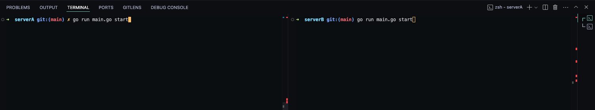
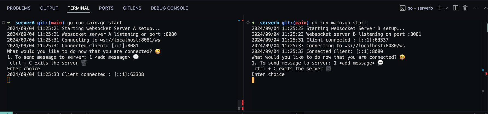
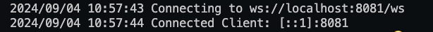
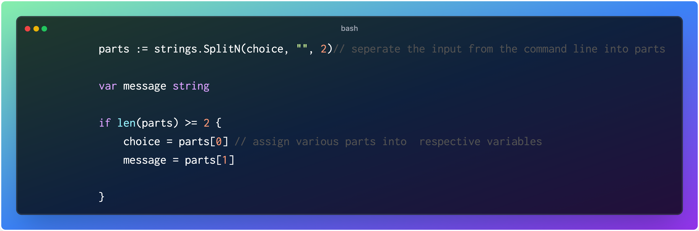
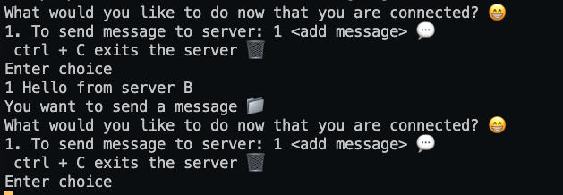
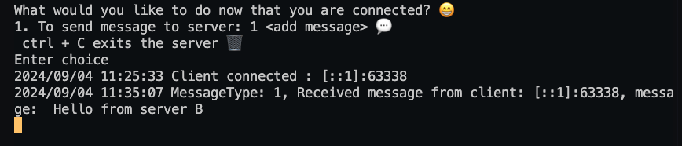

## WEB SOCKET SERVER
One of the drawbacks of HTTP is that it does not support real-time communication. Instead of having to poll every time web sockets eliminate that by having a Persistent connection with the server to keep real-time communication up and running 

## ARCHITECTURE
Here I have two distant servers called server A and server B respectively. Starting this are just regular HTTP servers but are upgraded to a web socket server
```
var upgrader =  websocket.Upgrader{
	ReadBufferSize: 1024,
	WriteBufferSize: 1024,}
```
Both servers run on defined port servers A: 8080 and B: 8081 using TCP protocol.

## GETTING STARTED

* Clone repository to your machine
``git clone git@github.com:Shoetan/fonu_assessment.git``

* The project is divided into servers and utils. Servers hold the implementation for the two distinct servers and utils hold the implementation of most of the reusable functions.
  
* To start both servers cd into the servers folder by ``cd servers``
  
* On two different terminal windows cd unto server a in one and server b in another. ``cd serverA`` and ``cd serverB``
  
* You have the setup like  this


* To start both servers run ``go run main.go start`` on both terminals. I am using Cobra to build this as a CLI application. NB: On starting the servers it waits for 10 seconds before trying to establish a connection to the other server. This just helps to make sure both servers are running else it terminates.
  
* The servers will come up and you will have an interface that looks like below


* A client has been connected to server A and server B  


* To send a message from a connected client to a server use the command line and enter ``1 <your message>``. In the background, your message is stripped from your command


* In action this looks like writing the below



* The server will receive your message and display it



* The servers and runtime are running concurrently in different go routines hence it does not time out until you send a close signal with ``ctrl + c``

## TESTING

Most important codes are found in the utils folder and tests can be run with ``go test -v ./utils/utils_test.go``

## OBSERVATIONS
* The concept of connecting servers ( in this context both servers act as clients to each other) while this is possible this approach is not recommended and will lead to very complex or even spaghetti code. WebSocket servers usually wait for clients to connect to them. They don't usually start the connection themselves. If you have two servers that connect, it's like mixing up who is the server and who is the client. This can make things more complicated to build and fix later.
